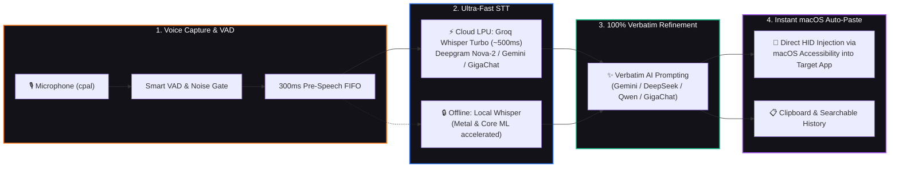

<div align="center">
  
  <h1>NYX Vox</h1>
  <p><strong>Premium, Zero-Latency AI Voice Interface for macOS</strong></p>

  <p>
    <a href="https://github.com/AVP-Dev/nyx-vox/releases/latest"></a>
    
    
  </p>

  <p>
    <a href="https://avp-dev.github.io/nyx-vox/" target="_blank" rel="noopener noreferrer">🌐 Interactive Landing Page</a> &nbsp;&bull;&nbsp;
    <a href="./README.ru.md">🇷🇺 Читать на русском</a> &nbsp;&bull;&nbsp;
    <a href="./docs/TECHNICAL.md" target="_blank" rel="noopener noreferrer">⚙️ Technical Specs</a> &nbsp;&bull;&nbsp;
    <a href="./docs/CHANGELOG.md" target="_blank" rel="noopener noreferrer">📝 Changelog</a>
  </p>
</div>

---

## ⚡ What is NYX Vox?

**NYX Vox** is a native macOS desktop tool designed to make voice your primary, frictionless input method across any application. Speak into your microphone, see words stream on the fly with animated audio waveforms, and watch your thought get transcribed at sub-500ms latency, refined with **100% verbatim AI formatting** (zero rewrites or hallucinations), and **automatically pasted straight into your focused app** (VS Code, Telegram, Slack, Notion, Obsidian, or your browser) without touching your mouse or pressing Cmd+V.

Built with **Rust 2021 (Tauri 2)** and **Next.js 16 / React 19**, NYX Vox runs with a lightweight footprint, Apple-native Glassmorphism aesthetics, and strict local privacy controls.

---

## 🚀 How It Works (Pipeline)



### 🛡️ Multi-Tier Resilient Fallback
NYX Vox features an **engine-agnostic, multi-tier fallback architecture** ensuring **zero lost dictations**:
1. **STT Tier**: If a live network stream drops or stalls during a long sentence, the engine immediately executes a full batch-STT pass on the recorded audio file.
2. **AI Tier**: If an LLM formatting provider hits rate limits (429/503), an automatic retry is scheduled; if it fails, NYX Vox **never discards your speech** — it instantly delivers the raw verbatim transcription.
3. **OS Injection Tier**: If macOS Accessibility permissions are revoked, the result window automatically expands with a one-click manual copy button.

---

## 🎙️ AI Transcription Engines (Comparison Matrix)

Bring your own API keys (stored locally with AES-256-GCM hardware encryption) or run 100% offline:

| Engine | Type | Latency | Privacy | Cost / Limits | Best For |
|---|---|---|---|---|---|
| **Groq LPU™** | Cloud LPU | **~500 ms** | Standard Cloud | Free Generous Tier | **[Recommended]** Daily driver, extreme speed |
| **Whisper Local** | On-Device | **~1.2 – 2.0 s** | **100% Private** | Free Forever | Confidential data, offline/travel use |
| **Sber GigaChat** | Cloud AI | **~700 ms** | Russian Cloud | Free Dev Tier | Native Russian dictation, works in РФ without VPN |
| **Google Gemini** | Multimodal | **~800 ms** | Google Cloud | Free AI Studio Quota | Complex code syntax & multi-language dictation |
| **Deepgram Nova** | Cloud STT | **~600 ms** | Enterprise | $200 Free Credits | Noisy backgrounds, acoustic isolation |

<details>
<summary><b>🔑 How to get free API keys in 2 minutes</b></summary>

- **Groq**: Go to [console.groq.com/keys](https://console.groq.com/keys) → Create an API key named `NYX-Vox`.
- **Google Gemini**: Go to [aistudio.google.com](https://aistudio.google.com/) → Click "Get API Key" → Create Key.
- **Deepgram**: Go to [console.deepgram.com](https://console.deepgram.com/) → Sign up for $200 free credit → Create API Key.
- **GigaChat (SberAI)**: Go to [developers.sber.ru](https://developers.sber.ru/) → Create GigaChat API project → Copy Client ID & Secret.
</details>

---

## 🖼️ Application Showcase & Interface

> *The interface uses glassmorphism translucent panels, dynamic resizing, and a round idle bubble mode.*

<div align="center">
  <table>
    <tr>
      <td width="50%" align="center">
        <strong>01. Floating Widget & Live Waveform</strong><br/>
        <sub>Pulsing mic, real-time 9-bar waveform & streaming interim preview</sub><br/><br/>
        
      </td>
      <td width="50%" align="center">
        <strong>02. Result Card & Auto-Paste Target</strong><br/>
        <sub>100% verbatim punctuation, edit/copy actions & one-click paste to focused app</sub><br/><br/>
        
      </td>
    </tr>
    <tr>
      <td width="50%" align="center">
        <strong>03. Multi-Engine & LLM Hub</strong><br/>
        <sub>Switch between Groq, Deepgram, Gemini, GigaChat & Local Whisper on the fly</sub><br/><br/>
        
      </td>
      <td width="50%" align="center">
        <strong>04. Hardware-Bound Encrypted Vault</strong><br/>
        <sub>AES-256-GCM encryption tied to machine-id (zero keys stored in cloud)</sub><br/><br/>
        
      </td>
    </tr>
  </table>
</div>

---

## ✨ Key Features

- ⚡ **Universal Live Streaming**: Real-time interim phrase preview with typing indicator across all STT engines.
- 🎯 **100% Verbatim AI Refinement**: Intelligent system prompts ensure zero hallucinations, zero synonym replacement, and strict preservation of emotional intent while formatting punctuation, capital letters, and technical syntax.
- 🧠 **Multi-LLM Formatter Support**: Format transcripts using Gemini, DeepSeek V3, Qwen 2.5, Groq Llama, or GigaChat.
- 🎙️ **Smart Speech Activity Detection (VAD)**: Configurable silence auto-stop (3.0s – 15.0s) with calibrated Noise Gate and microphone gain multiplier.
- 🚀 **Native macOS HID Auto-Paste**: Direct text injection via macOS Accessibility API into the active window.
- 🔒 **Encrypted Key Vault**: API keys are locally encrypted with AES-256-GCM using unique hardware fingerprints.
- 🫧 **Compact Bubble Mode**: Sits as a minimalist circular mic bubble next to the macOS menu bar when idle.
- 📂 **Local Searchable History**: Retain and search previous voice notes with duration, timestamp, and model badges.
- 🔇 **Anti-Hallucination Guard**: Automatic acoustic silence trimming (`trim_silence`) and media auto-pause during dictation.

---

## 📦 Installation & Setup

1. **Download**: Grab the latest `.dmg` from the [Releases](https://github.com/AVP-Dev/nyx-vox/releases/latest) page.
2. **Install**: Open the `.dmg` file and drag **NYX Vox** into your `Applications` folder.
3. **Launch**: Start NYX Vox from Applications.

### 🛠️ Troubleshooting: macOS "App is damaged" Warning
Because NYX Vox is an open-source tool without a paid Apple Developer subscription, macOS Gatekeeper may flag it on first run. Open **Terminal** and run:

```bash
xattr -cr /Applications/NYX\ Vox.app
```

Then launch the app again.

### 🔐 Permissions Monitoring Bridge
NYX Vox requires **Microphone** (for recording) and **Accessibility** (for automatic text paste) permissions:
- **Live Status**: Settings panel provides real-time green/red health indicators for system access.
- **Reset Permissions**: If macOS input events freeze after a macOS update, use the **Reset** button in Settings to clear the system cache and trigger a fresh prompt.

---

## ⌨️ Keyboard Shortcuts

| Shortcut | Action | Scope |
|---|---|---|
| `⌥ + Space` (Option + Space) | Toggle Dictation (Start / Stop) | Global (any app) |
| `Enter` | Send / Paste text to active application | In NYX Vox window |
| `Esc` | Cancel recording / clear text | In NYX Vox window |
| `Cmd + C` | Copy formatted text to clipboard | In NYX Vox window |

---

## 🚀 Roadmap

**Shipped in v1.4.0:**
- [x] Multi-engine STT pipeline (Whisper Offline / Groq / Deepgram / Gemini / GigaChat)
- [x] Universal live interim speech streaming preview
- [x] 100% Verbatim AI formatting (Gemini, DeepSeek, Qwen, Groq, GigaChat)
- [x] Custom AI model ID slot and presets
- [x] Smart VAD silence auto-stop (3.0s – 15.0s) & Noise Gate calibration
- [x] Glassmorphism UI & Compact Bubble idle mode
- [x] Native macOS HID Auto-Paste with real-time permissions bridge
- [x] AES-256-GCM hardware-bound API key vault
- [x] Searchable local dictation history

**Upcoming:**
- [ ] **Audio file transcription** — drag-and-drop audio files for batch transcription
- [ ] **System audio capture (calls/meetings)** — internal audio recording with speaker diarization
- [ ] **Custom global shortcut builder** — rebindable hotkeys
- [ ] **History export** — export transcriptions to Markdown, TXT, and JSON
- [ ] **Input device selector** — pick a specific microphone in Settings
- [ ] **Custom technical dictionary** — user-defined terms, acronyms, and names

---

## 🤝 Support & Contribution

NYX Vox is an open-heart project created by **Aliaksei Patskevich (AVPDev)** as a personal daily driver and a learning expedition into Rust and system-level audio engineering.

If you have architectural suggestions, code reviews, or bug reports, feel free to [Open an Issue](https://github.com/AVP-Dev/nyx-vox/issues) or reach out directly:

<p align="center">
  <a href="https://avpdev.com/"><b>Aliaksei Patskevich (AVPDev)</b></a>
  <br />
  <sub>
    <b>AI Solutions Architect</b> • Code, Design & AI
    <br />
    <a href="https://github.com/AVP-Dev">GitHub</a> &bull; <a href="https://t.me/AVP_Dev">Telegram</a>
  </sub>
</p>

<p align="center">
  
  
  
  
  
</p>
