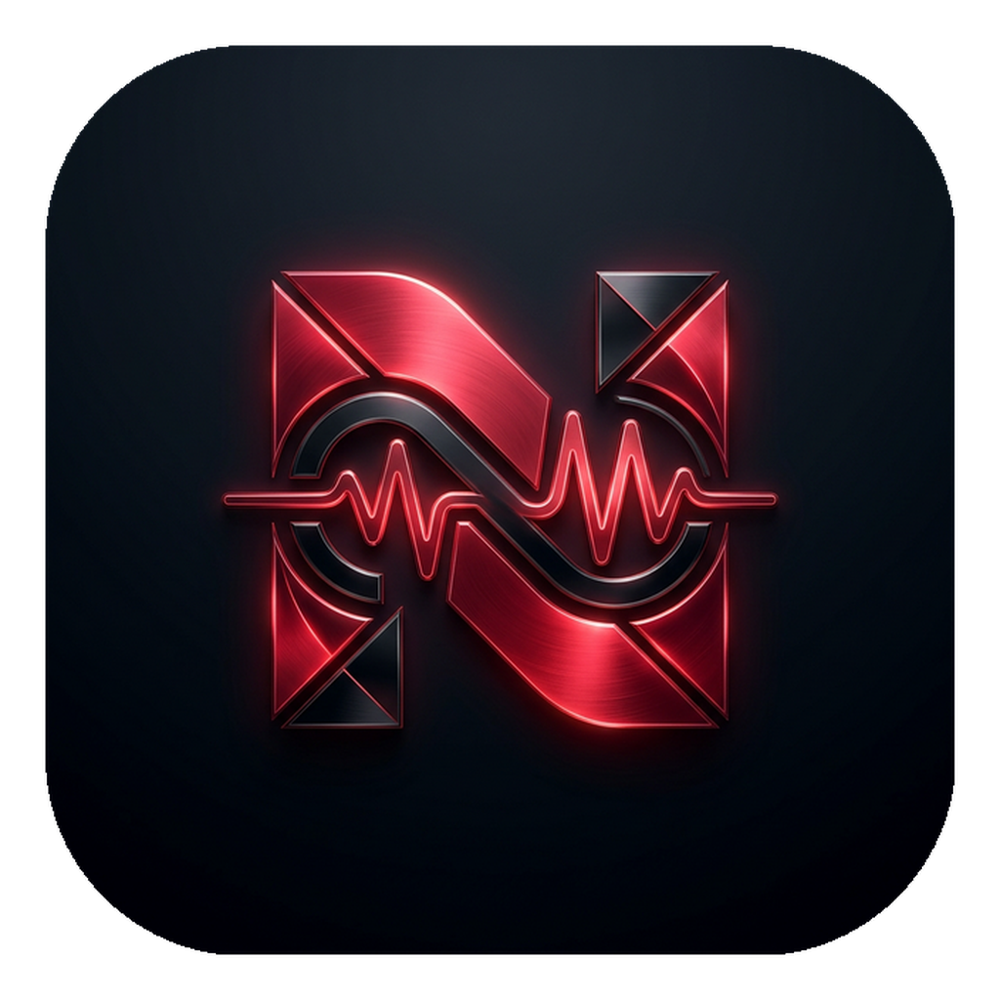

<div align="center">
  
  <h1>NYX Vox</h1>

  [](https://github.com/AVP-Dev/nyx-vox/releases/latest)

  <p>
    <a href="https://avp-dev.github.io/nyx-vox/" target="_blank" rel="noopener noreferrer">🌐 Лендинг</a> &nbsp;|&nbsp; 
    <a href="./README.md">🇺🇸 English Version</a> &nbsp;|&nbsp; 
    <a href="./docs/TECHNICAL.ru.md" target="_blank" rel="noopener noreferrer">⚙️ Техническая часть</a>
  </p>
</div>

Добро пожаловать в **NYX Vox**! Это тестовая версия приложения для голосового ввода, созданная для личного использования (себя и своих нужд). Это первый проект такого масштаба, написанный на **Rust**, поэтому мы очень ждем фидбэк, код-ревью и рекомендации по улучшению кодовой базы и архитектуры!

## 🌟 Наше Видение
NYX Vox — это быстрый, локально-ориентированный и облачно-ускоренный голосовой интерфейс на вашем рабочем столе. Проект стремится быть максимально функциональным, красивым, правдивым и предоставлять удобный UX с минимумом багов. Исходный код находится в открытом доступе для всего сообщества.

### 🎙 Движки Распознавания Речи (STT)
1. **CLOUD (Deepgram):** Мгновенная коммерческая модель. Идеально расставляет знаки препинания и отлично фильтрует шум.
2. **CLOUD (Groq):** Запускает нейросеть Whisper Large-v3-Turbo на инфраструктуре Groq. Безумная скорость STT бесплатно.
3. **OFFLINE (Whisper):** Локальная обработка `ggml-small.bin` прямо на вашем Mac совершенно без интернета. Максимальная приватность.

## � Установка и запуск

1. **Скачивание**: Возьмите последний `.dmg` файл на странице [Релизов](https://github.com/AVP-Dev/nyx-vox/releases).
2. **Установка**: Откройте скачанный `.dmg` и перетяните **NYX Vox** в папку `Applications` (Программы).
3. **Запуск**: Запустите приложение из папки Программы.

### 🛠 Решение проблем: Ошибка "Приложение повреждено"
Если macOS пишет, что приложение повреждено или его нельзя открыть, это связано с отсутствием платной цифровой подписи Apple. Чтобы это исправить:
1. Откройте **Терминал**.
2. Введите команду:
   ```bash
   xattr -cr /Applications/NYX\ Vox.app
   ```
3. Попросите систему открыть приложение снова.

## �🚀 Дорожная карта архитектуры
План развития находится в процессе написания, но главные векторы уже определены:
- [x] Базовый пайплайн распознавания речи (Whisper)
- [x] Аккуратный интерфейс (Glassmorphism)
- [ ] Продвинутая ИИ-аналитика и локальная суммаризация
- [ ] Мультимодальная обработка ввода
- [ ] Интеграция IoT (расширения для умного дома)
- [ ] Мобильное расширение
- [ ] Мультитенантность (Будущая интеграция в облако)

> [!TIP]
> Поскольку это наши первые уверенные шаги в экосистеме Rust (Tauri), будем рады любым отзывам и подсказкам для оптимизации архитектуры!

<br />
<p align="center">
  <a href="https://avpdev.com/en/"><b>Alexios Odos</b></a>
  &nbsp;|&nbsp;
  <a href="https://avpdev.com/ru/"><b>Aliaksei Patskevich</b></a>
  <br />
  <sub>
    <b>Software Engineer</b> • Code, Design & AI
    <br />
    <a href="https://github.com/AVP-Dev">GitHub</a> &bull; <a href="https://t.me/AVP_Dev">Telegram</a>
  </sub>
</p>

<p align="center">
  
  
  
  
  <br />
  
  
  
</p>

