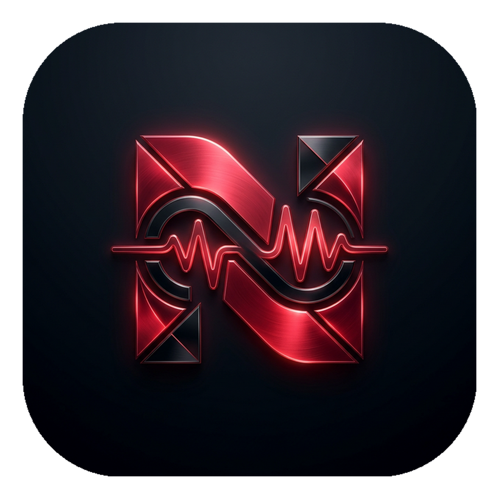

<div align="center">
  
  <h1>NYX Vox</h1>

  [](https://github.com/AVP-Dev/nyx-vox/releases/latest)

  **Текущий релиз: v1.1.0** &nbsp;·&nbsp; **Следующий релиз: v1.2.0** (в `dev`, ещё не опубликован)

  <p>
    <a href="https://avp-dev.github.io/nyx-vox/" target="_blank" rel="noopener noreferrer">🌐 Лендинг</a> &nbsp;|&nbsp;
    <a href="./README.md">🇺🇸 English Version</a> &nbsp;|&nbsp;
    <a href="./docs/TECHNICAL.ru.md" target="_blank" rel="noopener noreferrer">⚙️ Техническая часть</a> &nbsp;|&nbsp;
    <a href="./docs/CHANGELOG.ru.md" target="_blank" rel="noopener noreferrer">📝 История изменений</a>
  </p>
</div>

Добро пожаловать в **NYX Vox**! Это наш **самый первый проект на Rust** и наши первые шаги в этой экосистеме. Приложение создано для личного ежедневного использования, и так как мы только учимся работать с Rust, нам критически важны ваши замечания, код-ревью и советы по архитектуре!

## 🌟 Наше Видение
NYX Vox — это быстрый, локально-ориентированный и облачно-ускоренный голосовой интерфейс на вашем рабочем столе. Проект стремится быть максимально функциональным, красивым и удобным в повседневной работе. Исходный код открыт для всех желающих.

### 🎙 Движки Распознавания Речи (STT)
1. **CLOUD (Groq) — [Рекомендуется]:** Наш основной выбор. Запускает Whisper Large-v3-Turbo на сверхбыстрых чипах LPU™.
   <details>
   <summary><b>Как получить бесплатный ключ Groq</b></summary>
   1. Перейдите в <a href="https://console.groq.com/keys">Groq Cloud Console</a>.<br/>
   2. Войдите через Google или Почту.<br/>
   3. Нажмите "Create API Key", назовите его "NYX-Vox" и скопируйте.
   </details>

2. **CLOUD (Deepgram):** Коммерческая модель. Высокая стабильность и отличная фильтрация шумов.
   <details>
   <summary><b>Как получить ключ Deepgram</b></summary>
   1. Перейдите в <a href="https://console.deepgram.com/">Deepgram Console</a>.<br/>
   2. Создайте аккаунт.<br/>
   3. В разделе "API Keys" создайте новый ключ (New Key) и скопируйте его.
   </details>

3. **CLOUD (Gemini):** Google AI. Высокая точность для русской и английской диктовки, отличный запасной движок.
   <details>
   <summary><b>Как получить ключ Gemini</b></summary>
   1. Перейдите в <a href="https://aistudio.google.com/apikey">Google AI Studio</a>.<br/>
   2. Создайте API-ключ и скопируйте его.
   </details>

4. **CLOUD (GigaChat от SberAI):** Российская нейросеть. Работает в России без VPN, идеальна для русской диктовки.
   <details>
   <summary><b>Как получить ключ GigaChat</b></summary>
   1. Создайте аккаунт разработчика на <a href="https://developers.sber.ru/">developers.sber.ru</a>.<br/>
   2. Получите `client_id` и `client_secret` в кабинете разработчика SberAI.<br/>
   3. Вставьте их в Настройки → Ключи (приложение само соберёт Base64-ключ авторизации).
   </details>

5. **OFFLINE (Whisper):** Локальная обработка на вашем Mac (модели Small/Medium/Turbo, ускорение Metal/Core ML). Полная приватность без интернета.

## � Установка и запуск

1. **Скачивание**: Возьмите последний `.dmg` файл на странице [Релизов](https://github.com/AVP-Dev/nyx-vox/releases).
2. **Установка**: Откройте скачанный `.dmg` и перетяните **NYX Vox** в папку `Applications` (Программы).
3. **Запуск**: Запустите приложение из папки Программы.

### 🛠 Решение проблем: Ошибка "Приложение повреждено"
Если macOS пишет, что приложение повреждено или его нельзя открыть, это связано с отсутствием платной цифровой подписи Apple. Чтобы это исправить:
1. Откройте **Терминал**.
2. Введите команду:
   ```bash
   xattr -cr /Applications/NYX\ Vox.app
   ```
3. Попробуйте запустить приложение снова.

### 🔐 Права доступа и Безопасность
Для работы NYX Vox требуются права на **Микрофон** и **Универсальный доступ** (для автовставки текста). Мы внедрили нативный Rust-мост для **мониторинга статуса в реальном времени** прямо в панели настроек.

- **Автоматический режим**: Приложение мгновенно видит изменения в настройках системы. Если индикатор стал красным — доступ отозван.
- **Зачем нужен "Сброс разрешений"?**: Иногда macOS «зависает» и перестает передавать события ввода после обновления приложения или смены оборудования. Кнопка **Сбросить** в настройках очищает системный кэш разрешений для NYX Vox и инициирует повторный запрос.

> [!IMPORTANT]
> Из-за отсутствия платной подписи разработчика, macOS может сбрасывать права при каждом ручном обновлении. Если автовставка перестала работать — просто воспользуйтесь кнопкой **Сбросить** в приложении или вручную удалите `NYX Vox` из Системные настройки -> Конфиденциальность -> Универсальный доступ и перезапустите программу.

## 🚀 План развития (Roadmap)

**Готово:**
- [x] Пайплайн распознавания речи (Whisper офлайн / Groq / Deepgram / Gemini / GigaChat)
- [x] Современный интерфейс (Glassmorphism) и динамические окна
- [x] Нативная вставка текста (macOS HID) с проверкой Accessibility и статусом
- [x] Локальная история и поиск по текстам
- [x] **Интеллектуальное AI-форматирование**: модели (Gemini, DeepSeek, Qwen, Groq, GigaChat) для исправления грамматики, пунктуации и стиля (Casual / Professional)
- [x] Шумодав (Noise Gate) и настраиваемое усиление микрофона
- [x] Авто-пауза музыки во время диктовки
- [x] Шифрование API-ключей (AES-256-GCM, привязка к machine-id)
- [x] Компактный режим (idle-окно превращается в круглый бабл с микрофоном)

**В планах:**
- [ ] **Транскрипция аудиофайлов** — перетащите аудиофайл в приложение (или выберите через диалог) → автоматическая транскрипция и вывод текста
- [ ] **Запись системного аудио (звонки/созвоны)** — запись внутреннего аудио и ролевая транскрипция (отдельно «Вы» и «Собеседник»)
- [ ] **Кастомные глобальные горячие клавиши** — переназначение хоткеев
- [ ] **Экспорт истории** — сохранение транскрипций в TXT / MD / JSON
- [ ] **Выбор микрофона** — выбор устройства ввода в настройках (сейчас используется системный по умолчанию)
- [ ] **Автообновление** — проверка обновлений уже есть; дальше — автоматическая загрузка и установка
- [ ] **Пользовательский словарь** — свои термины, имена, техническая лексика
- [ ] **Детекция активности речи** — автопауза записи, когда вы замолчали
- [ ] **Кроссплатформенность** — поддержка Linux

> [!TIP]
> **Прозрачность и Доступность API**: В приложении используются современные, бесплатные или условно-бесплатные (Freemium) API модели. Мы выбираем решения вроде **Groq** и **Deepgram** не только из-за их мощности, но и потому, что они позволяют каждому разработчику или пользователю получить доступ к технологиям мирового уровня без огромных затрат.

> [!NOTE]
> Поскольку это наши первые уверенные шаги в экосистеме Rust (Tauri), будем рады любым отзывам и подсказкам для оптимизации архитектуры!

---

## 🤝 Поддержка и Участие
NYX Vox — это проект, создаваемый с душой. Если вы хотите **поддержать проект**, предложить новую функцию, дать совет по коду или сообщить о баге — пожалуйста, свяжитесь со мной! Ваше мнение помогает этому первому эксперименту на Rust вырасти в серьезный инструмент.

Вы можете [Открыть Issue](https://github.com/AVP-Dev/nyx-vox/issues) на GitHub или написать мне напрямую по ссылкам ниже.

<br />
<p align="center">
  <a href="https://avpdev.com/en/"><b>Alexios Odos</b></a>
  &nbsp;|&nbsp;
  <a href="https://avpdev.com/ru/"><b>Aliaksei Patskevich</b></a>
  <br />
  <sub>
    <b>Modern Web Architect</b> • Code, Design & AI
    <br />
    <a href="https://github.com/AVP-Dev">GitHub</a> &bull; <a href="https://t.me/AVP_Dev">Telegram</a>
  </sub>
</p>

<p align="center">
  
  
  
  
  <br />
  
  
  
</p>

