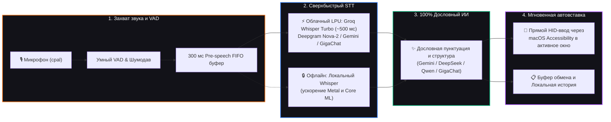
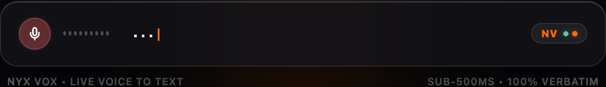
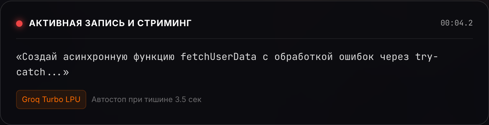
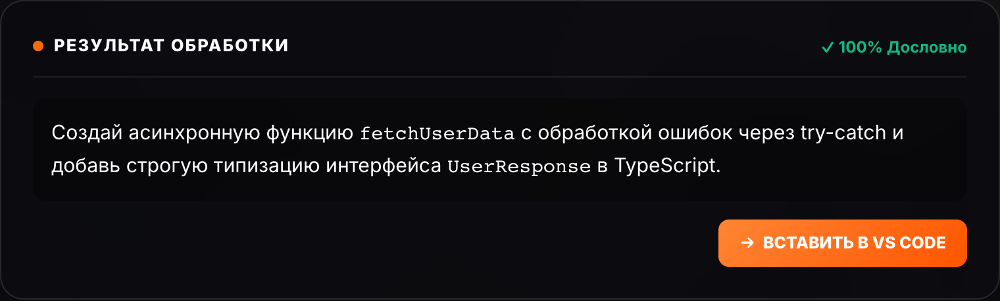
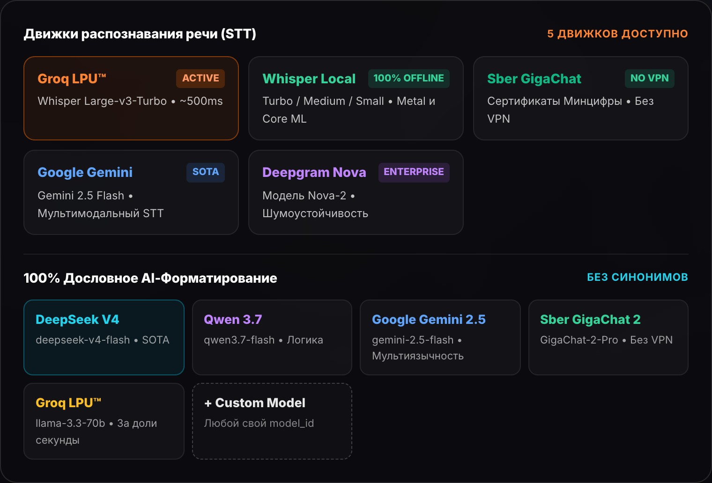
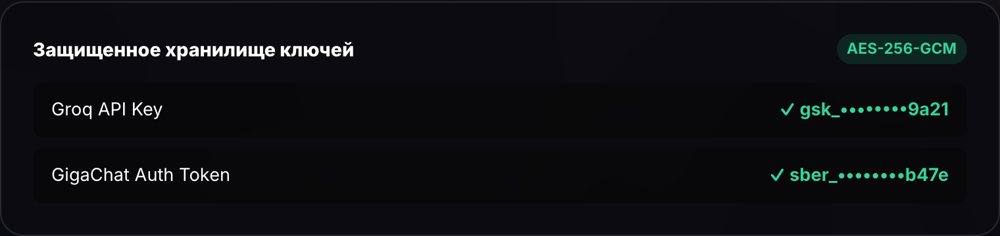
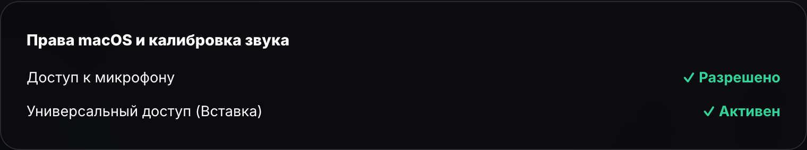

<div align="center">
  
  <h1>NYX Vox</h1>
  <p><strong>Премиальный голосовой интерфейс с нулевой задержкой для macOS и Windows</strong></p>

  <p>
    <a href="https://github.com/AVP-Dev/nyx-vox/releases/latest"></a>
    
    
  </p>

  <p>
    <a href="https://avp-dev.github.io/nyx-vox/" target="_blank" rel="noopener noreferrer">🌐 Интерактивный Лендинг</a> &nbsp;&bull;&nbsp;
    <a href="./README.md">🇬🇧 Read in English</a> &nbsp;&bull;&nbsp;
    <a href="./docs/TECHNICAL.ru.md" target="_blank" rel="noopener noreferrer">⚙️ Технические детали</a> &nbsp;&bull;&nbsp;
    <a href="./docs/CHANGELOG.ru.md" target="_blank" rel="noopener noreferrer">📝 История изменений</a>
  </p>
</div>

---

## ⚡ Что такое NYX Vox?

**NYX Vox** — это нативное мультиплатформенное приложение (macOS и Windows), созданное для того, чтобы сделать ваш голос главным и самым быстрым способом ввода в любых программах. Нажмите горячую клавишу или кнопку записи, говорите естественно — слова появляются на лету с живой анимацией звуковой волны, расшифровываются с задержкой менее 500 мс, форматируются **100% дословным ИИ** (без галлюцинаций, искажений и замены синонимами) и **автоматически вставляются прямо в активное приложение** (VS Code, Telegram, Slack, Notion, Obsidian или браузер) без необходимости прикасаться к мыши или нажимать Cmd+V / Ctrl+V.

Приложение написано на **Rust 2021 (Tauri 2)** и **Next.js 16 / React 19**, работает быстро и плавно, использует современную эстетику Glassmorphism и гарантирует безопасность ваших данных.

---

## 🚀 Как это устроено (Пайплайн работы)


```mermaid
graph LR
    subgraph Step1 ["1. Захват звука и VAD"]
        MIC["🎙 Микрофон (cpal)"] --> VAD["Умный VAD & Шумодав"]
        VAD --> BUFF["300 мс Pre-speech FIFO буфер"]
    end

    subgraph Step2 ["2. Сверхбыстрый STT"]
        BUFF --> CLOUD["⚡ Облачный LPU: Groq Whisper Turbo (~500 мс)<br/>Deepgram Nova-2 / Gemini / GigaChat"]
        BUFF -.-> LOCAL["🔒 Офлайн: Локальный Whisper<br/>(ускорение Metal и Core ML)"]
    end

    subgraph Step3 ["3. 100% Дословный ИИ"]
        CLOUD --> LLM["✨ Дословная пунктуация и структура<br/>(Gemini / DeepSeek / Qwen / GigaChat)"]
        LOCAL --> LLM
    end

    subgraph Step4 ["4. Мгновенная автовставка"]
        LLM --> PASTE["🚀 Прямой HID-ввод через<br/>macOS Accessibility в активное окно"]
        LLM --> CLIP["📋 Буфер обмена и Локальная история"]
    end

    style Step1 fill:#121218,stroke:#f97316,stroke-width:2px,color:#fff
    style Step2 fill:#121218,stroke:#3b82f6,stroke-width:2px,color:#fff
    style Step3 fill:#121218,stroke:#10b981,stroke-width:2px,color:#fff
    style Step4 fill:#121218,stroke:#a855f7,stroke-width:2px,color:#fff
```

### 🛡️ Многоуровневая отказоустойчивость (Multi-Tier Fallback)
Архитектура NYX Vox построена по принципу **движко-независимой сохранности данных** — надиктованный текст **никогда не теряется**:
1. **Уровень STT**: Если сетевой стриминг прервался на длинной фразе из-за сетевого спайка, система моментально запускает полный батч-STT прогон сохраненного аудиофайла.
2. **Уровень AI**: Если сервис форматирования перегружен или исчерпал лимиты квот (429/503), приложение пробует авто-повтор, а в случае неудачи **не сбрасывает текст**, а сразу отдает сырой исходный результат транскрибации.
3. **Уровень вставки ОС**: Если в macOS отозваны права Accessibility, окно результата не закрывается впустую, а отображает кнопку копирования текста в один клик.

---

## 🎙️ Матрица сравнения STT-движков

Используйте собственные API-ключи (защищены аппаратным шифрованием AES-256-GCM) или запускайте полностью локальные модели без интернета:

| Движок | Тип | Задержка | Приватность | Квоты / Стоимость | Идеально подходит для |
|---|---|---|---|---|---|
| **Groq LPU™** | Cloud LPU | **~500 мс** | Стандартная | Щедрый бесплатный тир | **[Рекомендуется]** Повседневная работа, максимальная скорость |
| **Whisper Local** | On-Device | **~1.2 – 2.0 с** | **100% Приватно** | Бесплатно навсегда | Конфиденциальные данные, работа в поездках/без сети |
| **Sber GigaChat** | Cloud AI | **~700 мс** | Российский контур | Бесплатно разработчикам | Русскоязычная диктовка, работает в РФ без VPN |
| **Google Gemini** | Multimodal | **~800 мс** | Google Cloud | Бесплатные квоты AI Studio | Сложный синтаксис кода, смешанные языки |
| **Deepgram Nova** | Cloud STT | **~600 мс** | Корпоративная | $200 кредитов на старте | Шумные помещения, акустическая изоляция |

### ✨ 100% Дословное AI-форматирование (LLM)
NYX Vox форматирует сырой текст с полным сохранением каждого слова (без пересказа и синонимов), расставляя пунктуацию, регистр и структуру:
- **DeepSeek V4 (`deepseek-v4-flash`)**: Флагманский SOTA-интеллект для расстановки пунктуации, кода и терминов.
- **Qwen 3.7 (`qwen3.7-flash` / `plus`)**: Высокая скорость, современная логическая структура и абзацы.
- **Google Gemini 3.8 (`gemini-3.8-flash` / `pro`)**: Превосходная работа со смешанными языками и сложным контекстом.
- **Sber GigaChat 2 (`GigaChat-2-Pro` / `Max`)**: Нативная русская грамматика с сертификатами Минцифры, без VPN.
- **Groq LPU™ (`llama-3.3-70b-versatile`)**: Сверхбыстрое форматирование за доли секунды на чипах LPU.
- **Слот кастомных моделей**: Возможность указать любой свой идентификатор модели на лету.

<details>
<summary><b>🔑 Как получить бесплатные API-ключи за 2 минуты</b></summary>

- **Groq**: Зайдите на [console.groq.com/keys](https://console.groq.com/keys) → Нажмите "Create API Key", назовите `NYX-Vox` и скопируйте.
- **Google Gemini**: Перейдите в [aistudio.google.com](https://aistudio.google.com/) → Нажмите "Get API Key" → Create Key.
- **Deepgram**: Зарегистрируйтесь на [console.deepgram.com](https://console.deepgram.com/) → Получите $200 на баланс → Создайте ключ.
- **GigaChat (SberAI)**: Перейдите на [developers.sber.ru](https://developers.sber.ru/) → Создайте проект GigaChat API → Скопируйте Client ID и Client Secret.
</details>

---

## 🎬 Интерактивная демонстрация работы

<div align="center">
  
  <br/>
  <sub><i>Универсальный live-стриминг &bull; Анимированная звуковая волна &bull; 100% Дословный ИИ &bull; Нативная автовставка в активное окно</i></sub>
</div>

---

## ✨ Ключевые возможности

- ⚡ **Универсальный Live-стриминг**: отображение промежуточных фраз на лету с активным курсором во всех STT-движках.
- 🎯 **100% Дословное AI-форматирование**: строгий системный промпт запрещает искажать слова, додумывать факты или заменять термины синонимами, аккуратно расставляя пунктуацию, абзацы и верный регистр букв.
- 🧠 **Поддержка множества LLM**: форматирование через DeepSeek V4, Qwen 3.7, Gemini 3.8, Groq LPU или GigaChat 2.
- 🎙️ **Умный VAD (автостоп по тишине)**: настраиваемый таймер паузы (3.0–15.0 сек) с калибруемым шумодавом (Noise Gate) и множителем усиления микрофона.
- 🚀 **Нативная автовставка macOS (HID)**: текст мгновенно вводится в окно, в котором вы только что работали, через Accessibility API.
- 🔒 **Защищенный сейф API-ключей**: локальное шифрование AES-256-GCM с уникальным аппаратным отпечатком устройства.
- 🫧 **Компактный режим (Bubble Mode)**: в режиме ожидания окно сворачивается в круглый минималистичный пузырь у меню-бара.
- 📂 **Локальная история с поиском**: сохранение всех диктовок с указанием времени, длительности и использованного движка.
- 🔇 **Защита от галлюцинаций**: аппаратная обрезка пауз тишины (`trim_silence`) и авто-пауза мультимедиа во время диктовки.

---

## 🖥️ Создан для macOS: Галерея интерфейса

<table align="center" width="100%">
  <tr>
    <td width="50%" align="center">
      <b>🎙️ Живой стриминг распознавания</b><br/><br/>
      
    </td>
    <td width="50%" align="center">
      <b>✨ 100% Дословный результат и автовставка</b><br/><br/>
      
    </td>
  </tr>
  <tr>
    <td colspan="2" align="center">
      <br/>
      <b>⚡ Центр управления STT-движками и AI-моделями</b><br/><br/>
      
    </td>
  </tr>
  <tr>
    <td width="50%" align="center">
      <br/>
      <b>🔒 Защищенный сейф API-ключей (AES-256)</b><br/><br/>
      
    </td>
    <td width="50%" align="center">
      <br/>
      <b>🎛️ Калибровка звука и права macOS</b><br/><br/>
      
    </td>
  </tr>
</table>

---

## 📦 Установка и запуск

1. **Скачивание**: Возьмите свежий `.dmg` на странице [Релизов](https://github.com/AVP-Dev/nyx-vox/releases/latest).
2. **Установка**: Откройте скачанный `.dmg` и перетащите **NYX Vox** в папку `Applications` (Программы).
3. **Запуск**: Запустите приложение из папки Программы.

### 🛠️ Решение проблем: Ошибка macOS «Приложение повреждено»
Поскольку NYX Vox распространяется как бесплатный Open Source проект без платной подписки Apple Developer, Gatekeeper macOS может заблокировать первый запуск. Откройте **Терминал** и выполните команду:

```bash
xattr -cr /Applications/NYX\ Vox.app
```

Затем откройте приложение повторно.

### 🔐 Мониторинг системных разрешений
Для работы приложению требуются разрешения на **Микрофон** и **Универсальный доступ** (для эмуляции клавиатурного ввода):
- **Индикаторы статуса**: Панель настроек в реальном времени отображает зелёные/красные бейджи прав системы.
- **Кнопка сброса прав**: Если после обновления macOS события ввода перестали передаваться, используйте кнопку **Сбросить** в Настройках для очистки системного кэша разрешений.

---

## 💻 Платформы: macOS и Windows

NYX Vox разработан для максимальной производительности на обеих десктопных операционных системах:

| Возможность | macOS | Windows |
|---|---|---|
| **Основная горячая клавиша** | `⌥ Option + Space` (или `Ctrl + Space`) | `Ctrl + Space` (системно совместима) |
| **Автопаста в активное окно** | Нативный HID-ввод через Accessibility API | Нативная эмуляция через Windows API (`enigo` / Win32) |
| **Локальный Whisper (офлайн)** | Аппаратное ускорение Metal + Core ML | Высокоскоростной CPU-инференс (AVX2/AVX512) |
| **Облачные STT и LLM (Groq, Deepgram, Gemini, GigaChat)** | Сверхбыстрый стриминг без привязки к железу | Сверхбыстрый стриминг без привязки к железу |
| **Требуемые права доступа** | Доступность (Accessibility) + Микрофон | Только Микрофон (Accessibility не требуется) |

> [!IMPORTANT]
> **❤️ Важное обращение к пользователям Windows и Mac (Feedback & Quality):**
> Версия для Windows собрана нативно с использованием Tauri 2, Rust и Win32 API. Поскольку основное рабочее окружение команды разработки — macOS, мы физически не можем лично тестировать каждую конфигурацию Windows, драйверов микрофонов и сторонних программ.
> 
> Мы искренне просим каждого, кто пользуется NYX Vox (как на Windows, так и на Mac):
> - **Пожалуйста, делитесь вашим фидбэком!** Рассказывайте, как работает распознавание, плавно ли срабатывает автовставка в ваших приложениях (VS Code, Telegram, Word, Notion, Obsidian, браузеры).
> - Заметили баг, задержку или шероховатость интерфейса? Смело создавайте [Issue на GitHub](https://github.com/AVP-Dev/nyx-vox/issues) или пишите напрямую автору!
> 
> Чем больше живой обратной связи от сообщества — тем качественнее, быстрее и стабильнее становится NYX Vox для каждого из нас!

---

## ⌨️ Горячие клавиши

| Сочетание | Действие | Где работает |
|---|---|---|
| `⌥ + Space` (Mac) / `Ctrl + Space` (Windows) | Включение / остановка записи | Глобально в любом приложении |
| `Enter` | Отправить / вставить текст в активное окно | В окне NYX Vox |
| `Esc` | Отмена записи / сброс текста | В окне NYX Vox |
| `Cmd + C` (Mac) / `Ctrl + C` (Windows) | Копировать распознанный текст | В окне NYX Vox |

---

## 🚀 План развития (Roadmap)

**Готово в релизе v1.5.0:**
- [x] Кроссплатформенная нативная поддержка Windows 10/11 (Tauri 2, Win32 API, NSIS `.exe` установщик)
- [x] Полноценный выбор движка форматирования Groq LPU™ (`llama-3.3-70b-versatile`) в настройках
- [x] Мульти-движковый пайплайн STT (Whisper офлайн / Groq / Deepgram / Gemini / GigaChat)
- [x] Универсальный live-стриминг фраз на лету
- [x] 100% Дословное AI-форматирование (Gemini, DeepSeek, Qwen, Groq, GigaChat)
- [x] Слот для ввода кастомных ID моделей LLM
- [x] Умный VAD-автостоп по тишине (3.0–15.0 сек) и калибровка Noise Gate
- [x] Стеклянный интерфейс Glassmorphism и режим круглого пузыря (Bubble)
- [x] Нативная автовставка текста в активное окно
- [x] Локальный зашифрованный сейф ключей (AES-256-GCM)
- [x] Локальная история с мгновенным поиском

**В планах:**
- [ ] **Транскрипция аудиофайлов** — drag & drop аудиофайлов для пакетного распознавания
- [ ] **Запись системного звука (созвоны)** — запись входящего аудио с разделением собеседников (диаризация)
- [ ] **Кастомный конструктор горячих клавиш** — переназначение шорткатов
- [ ] **Экспорт истории** — выгрузка в Markdown, TXT и JSON
- [ ] **Выбор микрофона** — выбор конкретного устройства аудиоввода в Настройках
- [ ] **Пользовательский словарь терминов** — специализированная лексика, сленг и имена

---

## 🤝 Поддержка и Участие

NYX Vox — открытый проект, создаваемый с душой **Алексеем Пацкевичем (AVPDev)** как личный инструмент ежедневного использования и исследовательский путь в экосистему Rust и системное аудио.

Если у вас есть идеи, рекомендации по архитектуре, замечания по код-ревью или сообщения об ошибках — будем рады [Созданному Issue](https://github.com/AVP-Dev/nyx-vox/issues) или прямому сообщению:

<p align="center">
  <a href="https://avpdev.com/"><b>Алексей Пацкевич (AVPDev)</b></a>
  <br />
  <sub>
    <b>AI Solutions Architect</b> • Код, Дизайн и ИИ
    <br />
    <a href="https://github.com/AVP-Dev">GitHub</a> &bull; <a href="https://t.me/AVP_Dev">Telegram</a>
  </sub>
</p>

<p align="center">
  
  
  
  
  
</p>
