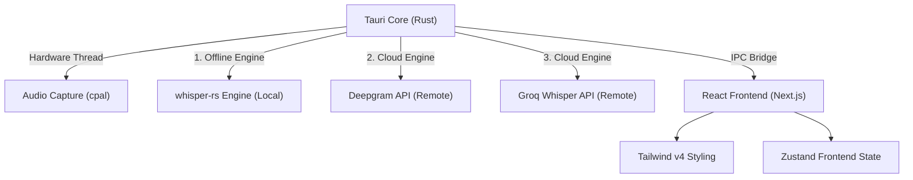

# NYX-Vox: Technical Specifications

[🏠 Home](../README.md) | [🇷🇺 Russian Version](./TECHNICAL.ru.md)

This document covers the architectural and technical aspects of NYX-Vox, a fast, locally executing Tauri-based desktop application.

---

## 🛠 Tech Stack Overview


> [!IMPORTANT]
> **Architect's Recommendation:** The current MVP operates completely offline, leveraging the local host environment and Tauri configurations for setup. However, should user state need to persist across devices or require multi-user access via a cloud synchronization setup, the infrastructure MUST transition to the **PostgreSQL** database stack, using **Drizzle ORM** for typed migrations, and **Redis** for performant caching. For Identity & Access Management, **Auth.js v5** or **Clerk** is highly recommended to conform to strictly enforced secure cloud persistence.

---

## 🧩 Architectural Topology



---

## 🚀 Getting Started

To spin up the local development environment ensuring you bypass remote API limits:

```bash
# Install lightning-fast dependencies using Bun
bun install

# Start the Next.js frontend alongside the Tauri Rust backend
bun run tauri dev
```

> [!TIP]
> All sensitive environmental setups and logs limit specific directory reporting for maximum privacy. No absolute paths or local system hashes are mapped during build cycles.

<br />
<p align="center">
  <a href="https://avpdev.com/en/"><b>Alexios Odos</b></a>
  &nbsp;|&nbsp;
  <a href="https://avpdev.com/ru/"><b>Aliaksei Patskevich</b></a>
  <br />
  <sub>
    <b>Software Engineer</b> • Code, Design & AI
    <br />
    <a href="https://github.com/AVP-Dev">GitHub</a> &bull; <a href="https://t.me/AVP_Dev">Telegram</a>
  </sub>
</p>

<p align="center">
  
  
  
  
  <br />
  
  
  
</p>

